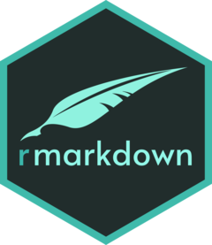

```{r setup, include=FALSE}
knitr::opts_chunk$set(echo = TRUE)
```

## 글자 형식 태그의 이해
### 볼드체와 이탤릭체

**마크다운(Markdown)**은 일반 *텍스트 기반*의 경량 **마크업 언어**입니다.

### 첨자

E = mc^2^에 의하면 에너지는 질량에 비례한다.

Y~i~ = X~i~ + 3

### 취소문자

~~하루에 30분 달리기~~
일주일에 ~~5번~~ 산책하기


## 문장 서식 태그의 이해
### 헤더

# Header 1
## Header 2
### Header 3
#### Header 4
##### Header 5
###### Header 6

### 인용구

**R 마크다운의 의의**는 무엇일까요?
> "R 마크다운은 재현 가능한 연구를 지원하는 훌륭한 솔루션입니다."

### 글머리 기호와 번호 매기기

R 마크다운의 기술적 요소는 다음과 같음:

* knitr
* markdown
* pandoc

R 마크다운 문서를 작성하는 방법은 다음과 같음:

1. 새파일 작성 메뉴를 이용해서 R 마크다운 템플리트를 생성한다.
1. R 코드 청크에 R 코드를 작성한다.
1. 코드의 설명과 실행 결과의 설명을 마크다운 태그를 이용해서 작성한다.
1. YAML 헤더를 수정하여 생성한 조판 서식을 조정한다.
1. "knit"를 눌러 문서를 생성한다.

R 마크다운의 기술적 요소는 다음과 같음:

* knitr
  + 청크를 실행함
    + R 소스 청크 외에 bash, python 청크도 가능
* markdown
  + 마크다운 문서를 조판함
* pandoc
  + PDF나 HTML 등 다른 문서로 변환함

R 마크다운 문서를 작성하는 방법은 다음과 같음:

1. 새파일 작성 메뉴를 이용해서 R 마크다운 템플리트를 생성한다.
    1. 에디터에서 그냥 작성해도 무방하다.
1. R 코드 청크에 R 코드를 작성한다.
    1. 코드청크 삽입 메뉴 아이콘을 누른다.
    1. 옵션을 추가하거나 변경합니다.
1. 코드의 설명과 실행 결과의 설명을 마크다운 태그를 이용해서 작성한다.
    1. 마크 다운이 아닌 텍스트만 사용해도 무방하다.
    1. 가급적 친절하게 자세히 기술한다.
1. YAML 헤더를 수정하여 생성한 파과 조판 서식을 조정한다.
1. "knit"를 눌러 문서를 생성한다.

### 수식 편집

$E = m \times c^{2}$에 의하면 에너지는 질량에 비례한다.

$\sigma = \sqrt{ \frac{1}{N} \sum_{i=1}^N (x_i -\mu)^2}$


## 테이블 태그와 수평선의 이해
### 테이블 그리기

First Header  | Second Header
--------------|-------------
Cell 1-1      | Cell 1-2
Cell 2-1      | Cell 2-2 

First Header  | Second Header | Third Header
--------------|---------------|--------------
Cell 1-1      | Cell 1-2      | Cell 1-3  
Cell 2-1      | Cell 2-2      | Cell 2-3  

사용자가 정렬 변경하기

우측 정렬     | 좌측 정렬     | 가운데 정렬
-------------:|:--------------|:------------:
Cell 1-1      | Cell 1-2      | Cell 1-3  
Cell 2-1      | Cell 2-2      | Cell 2-3  

### 수평선 그리기

앞 문장

***

가운데 문장

------

뒷 문장


## 이미지와 링크 삽입 태그의 이해
### 이미지 삽입


{: width="100" height="100"}


```{r, echo=FALSE, out.width = "50%", fig.align="center"}
knitr::include_graphics("img/markdown.png")
```

### 링크 삽입

[R Markdown 홈페이지](https://rmarkdown.rstudio.com/)


## 마크다운 튜토리얼
### 글자 형식, 문장 서식 태그 설정하기

## 마크다운

```{r, echo=FALSE, out.width = "30%", fig.align="left"}
knitr::include_graphics("img/markdown.png")
```

**마크다운(markdown)**은 일반 텍스트 기반의 경량 마크업 언어다. 일반 텍스트로 서식이 있는 문서를 작성하는 데 사용되며, 일반 마크업 언어에 비해 문법이 쉽고 간단한 것이 특징이다. **HTML**과 **리치 텍스트(RTF)** 등 서식 문서로 쉽게 변환되기 때문에 응용 소프트웨어와 함께 배포되는 README 파일이나 온라인 게시물 등에 많이 사용된다.

> 마크다운(markdown)은 일반 텍스트 기반의 경량 마크업 언어다. -위키피디아

## 역사
존 그루버는 2004년에 문법 면에서 에런 스워츠와 중대한 협업을 통해 마크다운 언어를 만들었으며, 사람들이 읽기 쉽고 쓰기 쉬운 플레인 텍스트 포맷을 사용하여 쓸 수 있으면서 구조적으로 유효한 XHTML(또는 HTML)로 선택적 변환이 가능하게 하는 것이 목표이다.

### 테이블 그리고 이미지 넣기

+---------------------+--------------------------------+---------------------------------+
| knitr               | rmarkdown                      | markdown                        |
+=====================+================================+=================================+
|   |          |            |
+---------------------+--------------------------------+---------------------------------+
| R 소스 청크를 해석  | YAML 헤더를 해석하고 문서 생성 | 텍스트에 서식을 부여, 문서 조판 |
+---------------------+--------------------------------+---------------------------------+
| * R 패키지          | * R 패키지                     | * R 패키지 아님                 |
| * 청크 실행         | * Pandoc 연동                  | * 문서 조판                     |
+---------------------+--------------------------------+---------------------------------+


